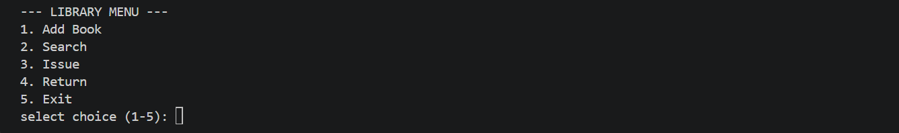
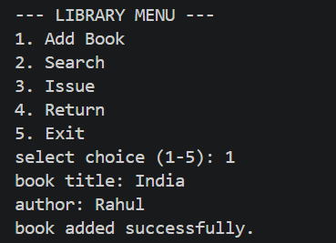
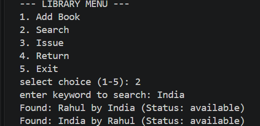
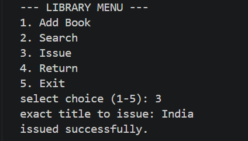
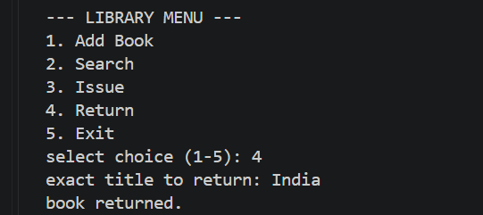
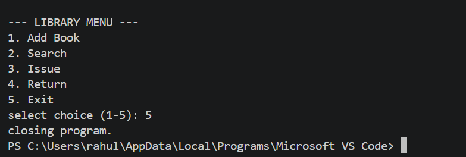

# Library Management System

## Project Title
Library Management System

## Overview
This is a simple command-line Python project for managing basic library operations. It allows a user to add books, search for books, issue books, return books, and exit the program.

## Features
- Add a book with its title and author
- Search for books using a title or author keyword
- Issue a book using its exact title
- Return a book using its exact title
- Shows the current status of books
- Simple menu-based command-line interface

## Technologies/Tools Used
- Python 3
- Visual Studio Code (VS Code) for development
- Command Prompt or PowerShell for running the program
- No external Python libraries are required

## Installation and Running

### Requirements
Python 3.x must be installed on the computer.

### Steps
1. Download or clone the project.
2. Open the project folder in VS Code or a terminal.
3. Open the terminal inside the project folder.
4. Run:

```bash
python main.py
```

## Testing Instructions

After running the program, test the options in the following order:

1. Select `1` and add a book by entering its title and author.
2. Select `2` and search for the book using part of its title or author name.
3. Select `3` and enter the exact title to issue the book.
4. Select `4` and enter the exact title to return the book.
5. Select `5` to close the program.

The screenshots below show the program being tested.

## Screenshots

### 1. Library Menu


### 2. Adding a Book


### 3. Searching for a Book


### 4. Issuing a Book


### 5. Returning a Book


### 6. Exiting the Program


## Project Structure

```text
Library_Helper_Project/
├── main.py
├── README.md
└── screenshots/
    ├── screen1.png
    ├── screen2.png
    ├── screen3.png
    ├── screen4.png
    ├── screen5.png
    └── screen6.png
```

## Note
The program stores book information in memory while it is running. The data is reset when the program is closed.
